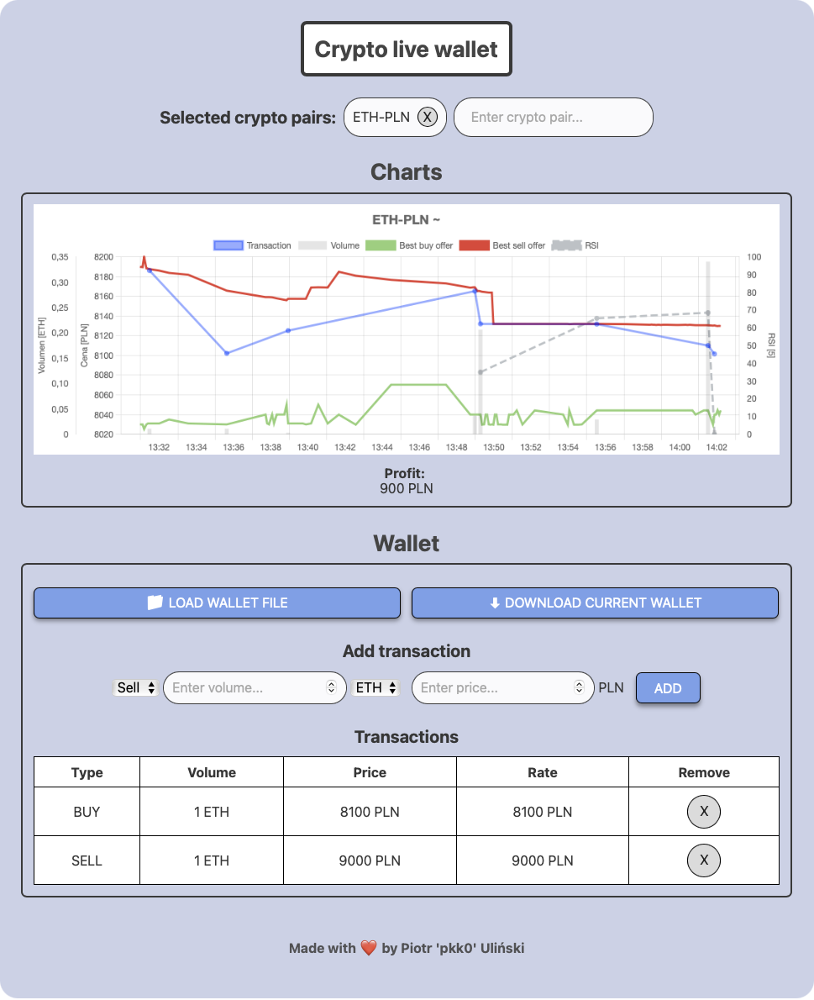

<h1 align='center'>Crypto live wallet</h1>
<p align='center'>
    <b>Crypto live wallet</b> is a lightweight single page application with live charts of your favourite cryptos and tracking profit.
    <br>
    <a href='https://crypto-live-wallet.surge.sh'>Open live demo now!</a>
</p>

<p align="center">
    
</p>

## Features
- Live charts of your favorite cryptos including: <br><i>transactions, volume, best buy offers, best sell offers, rsi</i>
- Saving transactions, calculating average buy rate and profit (first in first out rule)
- Trend determination based on the RSI

## Technologies
- Javascript
- Svelte

## Libraries
- Chart.js
- Simple Svelte Autocomplete

## Custom setup
Things like charts update interval, RSI period, trend period can be changed in App.svelte.

## Installing dependencies
To install dependencies type:
```bash
npm install
```

## Test run
To run the app localy without building just type:
```bash
npm run dev
```